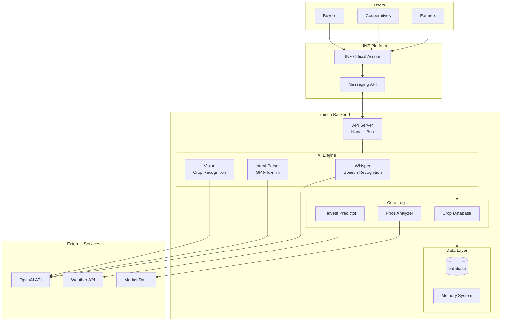
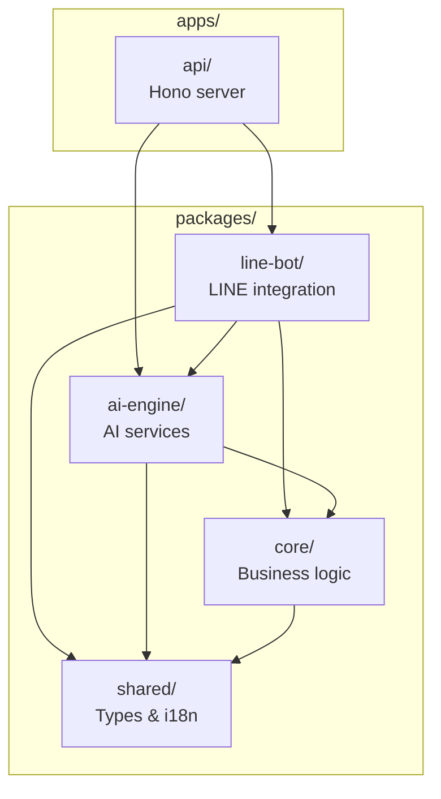
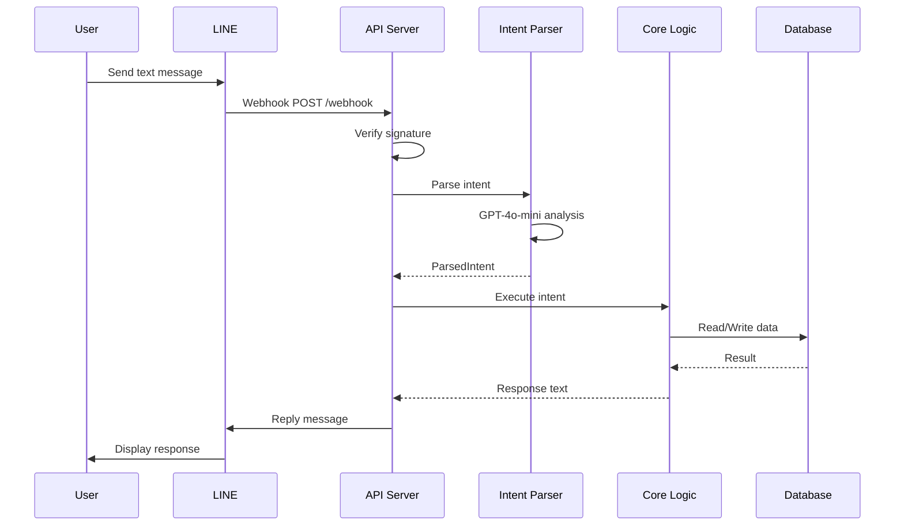
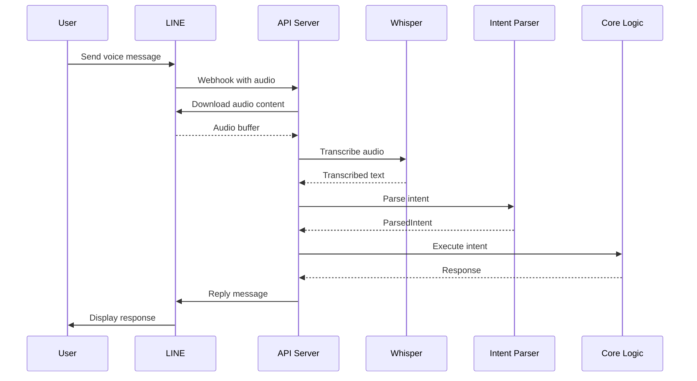
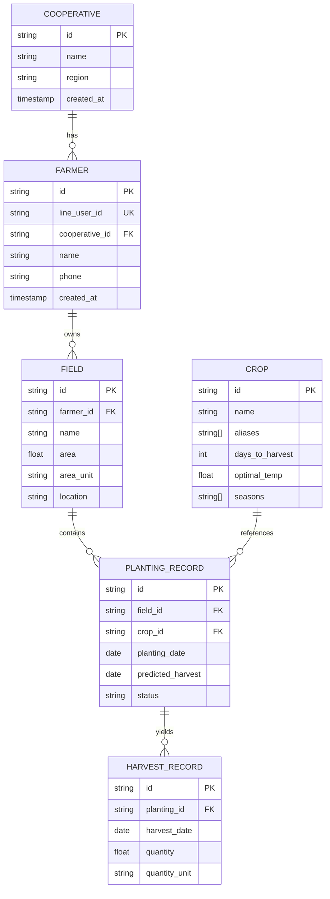

# Architecture

> System architecture and design decisions for minori

## Overview

minori is a monorepo-based application that provides an AI-powered interface for agricultural cooperatives through LINE messaging platform.

## System Architecture

## Package Structure

## Request Flow

### Text Message Processing

### Voice Message Processing

## Data Models

### Core Entities

## Technology Stack

| Layer | Technology | Purpose |
|-------|------------|---------|
| Runtime | Bun | Fast JavaScript runtime |
| Framework | Hono | Lightweight web framework |
| Language | TypeScript | Type-safe development |
| AI - Speech | OpenAI Whisper | Voice transcription |
| AI - NLU | GPT-4o-mini | Intent parsing |
| AI - Vision | GPT-4 Vision | Crop recognition |
| Messaging | LINE Messaging API | User interface |
| Monorepo | Turbo | Build orchestration |

## Design Decisions

### Why LINE?

1. **Ubiquity**: LINE is the dominant messaging app in Taiwan
2. **No installation**: Works within existing app
3. **Accessibility**: Familiar interface for elderly farmers
4. **Rich features**: Voice messages, images, rich menus

### Why Voice-First?

1. **Literacy barriers**: Some farmers may have limited literacy
2. **Hands-free**: Can record while working in fields
3. **Natural**: Speaking is more natural than typing
4. **Speed**: Faster than typing on mobile

### Why Bun?

1. **Speed**: Faster than Node.js for startup and execution
2. **All-in-one**: Built-in bundler, test runner, package manager
3. **TypeScript**: Native TypeScript support without compilation
4. **Modern**: ESM-first, Web API compatible

### Why Monorepo?

1. **Code sharing**: Shared types and utilities
2. **Atomic changes**: Single PR for cross-package changes
3. **Consistent tooling**: Same lint/format/test setup
4. **Simplified deps**: Single lockfile

## Security Considerations

### Authentication

- LINE user IDs are used for farmer identification
- Webhook signatures validated using HMAC-SHA256
- No passwords stored (LINE handles auth)

### Data Protection

- Multi-tenant data isolation by cooperative
- No PII stored beyond LINE user ID
- API keys stored in environment variables

### API Security

- All endpoints require valid LINE signature
- Rate limiting follows LINE API limits
- HTTPS enforced in production

## Future Considerations

### Scalability

- Database sharding by cooperative
- Redis for session/cache
- CDN for static assets

### Reliability

- Health check endpoints for monitoring
- Graceful error handling
- Retry logic for external APIs

### Observability

- Structured logging
- Request tracing
- Error tracking (Sentry)
